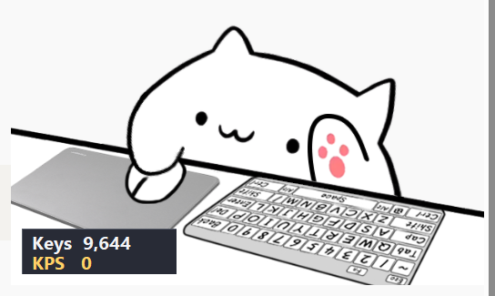

# BongoCat Stats Overlay

English · [简体中文](#简体中文)

A small **Windows-only** companion for [ayangweb/BongoCat](https://github.com/ayangweb/BongoCat). It adds a transparent, click-through `Keys` / `KPS` badge near the cat's lower-left corner without modifying BongoCat.

Version **0.1.0** has been tested manually with BongoCat v1.1.0 and Python 3.13 on Windows. CI runs unit tests on Python 3.10–3.13; other BongoCat versions and end-to-end GUI behavior on other Python versions have not been verified.



## What it counts

- `Keys`: keyboard down-presses **plus** left/right/middle/X1/X2 mouse-button clicks, accumulated across restarts.
- `KPS`: keyboard down-presses during the latest rolling second. Mouse clicks do not change KPS.
- Holding a key or mouse button, including dragging, counts once until released and pressed again. Wheel scrolling is not counted.

The app checks Windows virtual-key states about every 25 ms. Extremely short presses or clicks can be missed. It counts input even while BongoCat is temporarily closed; the badge waits for the cat to return.

## Install and run

Install [ayangweb/BongoCat](https://github.com/ayangweb/BongoCat/releases) separately, then in PowerShell or Command Prompt inside this repository:

```powershell
py -3.13 -m venv .venv
.\.venv\Scripts\python.exe -m pip install -e .
.\.venv\Scripts\python.exe -m bongocat_stats_overlay
```

After installation, `start.bat` starts the same app without a console. Use its `KPS` system-tray icon → **Exit Stats Overlay** to save and quit.

## Data and position

Runtime state is stored locally in `%LOCALAPPDATA%\BongoCatStatsOverlay\`:

- `stats.json` — the persistent aggregate total, saved about every five seconds and on normal exit.
- `config.json` — optional position offsets, created with defaults on first run.

`config.json` starts as:

```json
{
  "offset_x": 12,
  "offset_y": -62
}
```

The badge's top-left corner is positioned relative to BongoCat's bottom-left corner. Edit the two integer offsets and restart the overlay to move it. If `stats.json` is malformed, the original is preserved as `stats.corrupt-*.json` and a new total begins at zero. The file format is `{"total": 1234}`. An abrupt power loss may lose up to about five seconds of recent counts.

## Privacy and limitations

The program reads global Windows virtual-key **states** to detect new presses. It briefly keeps the current/previous pressed-key sets in memory for edge detection, but writes only the aggregate `total` to disk. The BongoCat window is identified transiently by its title and executable name. Dependencies are downloaded during installation with `pip`.

The badge uses a cross-process Windows owned-window relationship to stay above BongoCat. Closing BongoCat destroys only that badge; the hidden controller keeps counting and recreates a new badge when the cat returns.

## Development and license

Run tests with:

```powershell
.\.venv\Scripts\python.exe -m unittest discover -s tests -v
```

MIT license. Some Win32 helpers are adapted from Bel1eve-qiu/desktop-pet under MIT; see [THIRD_PARTY_NOTICES.md](THIRD_PARTY_NOTICES.md).

---

## 简体中文

[English](#bongocat-stats-overlay) · 简体中文

这是一个仅适用于 Windows 的 [ayangweb/BongoCat](https://github.com/ayangweb/BongoCat) 配套小工具。它会在猫咪左下角显示透明、可鼠标穿透的 `Keys` / `KPS` 统计条。

**0.1.0** 版在 Windows 上使用 BongoCat v1.1.0 和 Python 3.13 进行了人工实机测试。CI 会在 Python 3.10–3.13 上运行单元测试；其他 BongoCat 版本，以及其他 Python 版本下的完整图形界面行为尚未验证。

### 统计内容

- `Keys`：键盘按下次数，加上鼠标左键、右键、中键、X1、X2 的点击次数；总数会在重启后保留。
- `KPS`：最近一秒内的键盘按下次数；鼠标点击不计入 KPS。
- 按住按键或鼠标键（包括拖动）只计一次，松开后再次按下才会再计数；滚轮滚动不计数。

程序约每 25 毫秒读取一次 Windows 虚拟键状态，因此极短的按键或点击可能漏计。即使暂时关闭 BongoCat，统计仍会继续；猫咪回来后统计条会重新出现。

### 安装与运行

请先单独安装 [ayangweb/BongoCat](https://github.com/ayangweb/BongoCat/releases)，然后在本仓库目录打开 PowerShell 或命令提示符：

```powershell
py -3.13 -m venv .venv
.\.venv\Scripts\python.exe -m pip install -e .
.\.venv\Scripts\python.exe -m bongocat_stats_overlay
```

安装后也可双击 `start.bat`，以不显示控制台的方式启动。退出时，在系统托盘找到 `KPS` 图标，选择 **Exit Stats Overlay**，程序会保存统计数据并退出。

### 数据与位置

运行数据保存在本机的 `%LOCALAPPDATA%\BongoCatStatsOverlay\`：

- `stats.json`：累计总数，约每五秒保存一次，正常退出时也会保存。
- `config.json`：可选的位置偏移配置，首次运行时按默认值创建。

`config.json` 的默认内容：

```json
{
  "offset_x": 12,
  "offset_y": -62
}
```

统计条的左上角相对于 BongoCat 窗口的左下角定位。修改两个整数偏移值后，重启统计工具即可生效。如果 `stats.json` 已损坏，程序会将原文件保留为 `stats.corrupt-*.json`，然后从 0 开始计数。正常文件格式是 `{"total": 1234}`。突然断电最多可能损失约五秒内的计数。

### 开发与许可证

运行测试：

```powershell
.\.venv\Scripts\python.exe -m unittest discover -s tests -v
```

本项目采用 MIT 许可证。部分 Win32 辅助代码改编自同样使用 MIT 许可证的 Bel1eve-qiu/desktop-pet，原版权声明见 [THIRD_PARTY_NOTICES.md](THIRD_PARTY_NOTICES.md)。仓库不包含 BongoCat 程序或模型文件。
